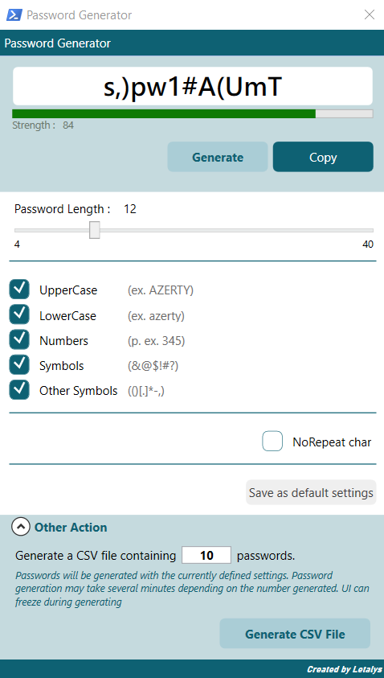

# Powershell : Password Generator

This is my own reusable and easily configurable password generator thanks to its various integrated functions.

On this page, you will find the module to use but also a use case via a user interface in WPF.

I hope you enjoy it  ;)


## Using Module [Password-Generator.psm1](./Lib/Password-Generator.psm1)

If you are only interested in the function module to integrate in you own app, you just have to get it from the "lib" directory

### How to use

You can save the PSM1 file wherever you want. Then simply import it directly into your code, specifying its location.

`Import-Module "Password-Generator.psm1" -Force`

Next you just have to specify your call parameters.

The NoRepeat option is used to generate a password with no duplicate characters. However if the unique character set available according to the options is less than the MinimumLenght option, the password will ignore this parameter.

_Example :_
```
$PasswordParameters = @{
        MinimumLength = 12
        IncludeUppercase = $true
        IncludeLowercase = $true
        IncludeNumbers =  $true
        IncludeSymbols = $true
        IncludeOtherSymbols = $true
        NoRepeat = $true
    }

    $result = Get-RandomPassword @PasswordParameters
    Write-Host $result.Password
    Write-Host = $result.Strength
```


## User Interface

If you want to get a password generator interface in powershell you can get the whole project. Then just run PWDGEN.Program.ps1.

You can create a manual desktop shortcut using this example :
`
C:\Windows\System32\WindowsPowerShell\v1.0\powershell.exe -windowstyle hidden -File "C:\User\letalys\Powershell-PasswordGenerator\Program\PWDGEN.Program.ps1"
`

The interface manages the different parameters available for the password generation function.

A feature also makes it possible to generate a file containing a number of passwords chosen by the user.


## 🔗 Links
https://github.com/Letalys/Powershell-PasswordGenerator


## Autor
- [@Letalys (GitHUb)](https://www.github.com/Letalys)
